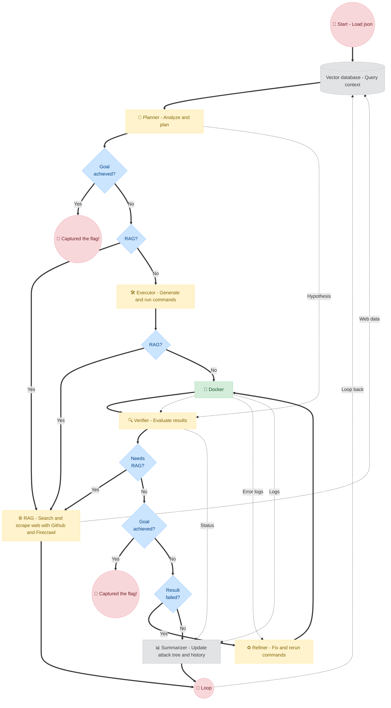

<div align="center"><pre>
╔══════════════════════════════════════════════════════════════════════════════╗
║                                                                              ║
║      ███████╗██╗   ██╗ ██████╗██╗  ██╗     ██████╗████████╗███████╗          ║
║      ██╔════╝██║   ██║██╔════╝██║ ██╔╝    ██╔════╝╚══██╔══╝██╔════╝          ║
║      █████╗  ██║   ██║██║     █████╔╝     ██║        ██║   █████╗            ║
║      ██╔══╝  ██║   ██║██║     ██╔═██╗     ██║        ██║   ██╔══╝            ║
║      ██║     ╚██████╔╝╚██████╗██║  ██╗    ╚██████╗   ██║   ██║               ║
║      ╚═╝      ╚═════╝  ╚═════╝╚═╝  ╚═╝     ╚═════╝   ╚═╝   ╚═╝               ║
║                                                                              ║
╚══════════════════════════════════════════════════════════════════════════════╝
</pre></div>

<div align="center">

**Fuck CTF — LLM Agent for Autonomous CTF Solving**

[](https://www.python.org/)
[](https://www.docker.com/)
[](LICENSE)
[](#)

</div>

---

## 📌 Introduction

**Fuck CTF** is an autonomous LLM-based agent that solves Capture The Flag challenges end-to-end — from reading the challenge description to submitting the flag — without human intervention.

The framework orchestrates six specialized AI modules in a closed loop: **Planner → Executor → Verifier → Refiner → Summarizer → Reflector**. It dynamically switches between reasoning, web-searching, sandboxed code execution, output verification, iterative self-correction, and high-level strategy reflection until the flag is captured.

**Core Capabilities:**

| Module | Role |
|---|---|
| 🧠 **Planner** | Analyzes the challenge and decomposes it into a prioritized Attack Tree of subtasks |
| 🌐 **RAG** | Searches GitHub repos and web pages (via Firecrawl) when the agent encounters unfamiliar vulnerabilities |
| 🛠️ **Executor** | Generates and runs terminal commands, compiled binaries, and Python scripts |
| 🐳 **Docker Sandbox** | Provides a disposable, isolated environment to safely interact with targets |
| 🔍 **Verifier** | Evaluates raw command output against the Planner's hypothesis to classify success or failure |
| ♻️ **Refiner** | Diagnoses errors and rewrites broken commands or scripts to fix failures iteratively |
| 📊 **Summarizer** | Distills execution logs into structured observations and updates the Attack Tree |
| 🪞 **Reflector** | Intervenes when the agent is stuck for multiple cycles to backtrack and rethink strategy |

---

## 📂 Repo Structure

```text
.
├── agent/              # Core orchestrator loop + all agent modules
│   ├── planner/        # Planner: subtask generation & Attack Tree management
│   ├── executor/       # Executor: command generation
│   ├── verifier/       # Verifier: result evaluation
│   ├── refiner/        # Refiner: error correction
│   ├── summarizer/     # Summarizer: observation synthesis
│   ├── reflector/      # Reflector: strategy backtracking
│   └── core/           # Memory (ChromaDB), state, and shared utilities
├── benchmark/          # Challenge JSON configs organized by platform & category
├── cli/                # Terminal UI rendering (ASCII art, panels, progress)
├── db/                 # Persistent ChromaDB vector store for RAG context
├── docs/               # Documentation
├── rag/                # Retrieval-Augmented Generation (GitHub + Firecrawl)
├── workspace/          # ← Place challenge files here (mounted to /data in Docker)
├── config.example.json # Config template
├── run.py              # Main entry point
└── sandbox.py          # Docker sandbox lifecycle manager
```

---

## ⚙️ Workflow



---

## 🚀 Installation

> **Requirements:** Python 3.9+, Docker (must be running)

**1. Clone the repository**

```bash
git clone https://github.com/Hugnd-UIT/Fuck-CTF.git
cd Fuck-CTF
```

**2. Create and activate a virtual environment**

```bash
python -m venv venv

# Linux / macOS
source venv/bin/activate

# Windows
.\venv\Scripts\activate
```

**3. Install dependencies**

```bash
pip install -r requirements.txt
```

---

## 🛠️ Setup

Copy the environment file and fill in your API keys:

```bash
cp .env_example .env
```

| Variable | Description | Required |
|---|---|---|
| `OPENAI_API_KEY` | OpenAI key (or OpenRouter / DeepSeek proxy) | ✅ |
| `OPENAI_BASE_URL` | API base URL (for proxy providers) | ✅ |
| `GITHUB_API_KEY` | GitHub Personal Access Token for RAG search | ✅ |
| `FIRECRAWL_API_KEY` | Firecrawl API key for web scraping | ✅ |
| `HF_TOKEN` | Hugging Face token (local models only) | Optional |
| `CUDA_VISIBLE_DEVICES` | GPU IDs for local model inference (e.g. `0,1`) | Optional |

---

## 🎯 Fuck CTF

**1. Drop challenge files into `workspace/`**

If the challenge provides downloadable files (source code, pcap, zip, binary), place them in the `workspace/` directory. This folder is automatically mounted to `/data` inside the Docker container.

> [!WARNING]
> Always **clear `workspace/`** before starting a new challenge. Leftover files from previous runs will confuse the agent.

**2. Create a `config.json`**

Use any file in `benchmark/` as a template, or create one from scratch:

```json
{
    "planner": {
        "model": "openai/gpt-4o",
        "local": false,
        "temperature": 0.7,
        "top": 0.9,
        "sample": true,
        "tokens": 4096
    },
    "executor": {
        "model": "openai/gpt-4o-mini",
        "local": false,
        "temperature": 0.2,
        "top": 1.0,
        "sample": false,
        "tokens": 4096
    },
    "verifier": {
        "model": "openai/gpt-4o-mini",
        "local": false,
        "temperature": 0.1,
        "top": 1.0,
        "sample": false,
        "tokens": 4096
    },
    "refiner": {
        "model": "openai/gpt-4o-mini",
        "local": false,
        "temperature": 0.2,
        "top": 1.0,
        "sample": false,
        "tokens": 4096
    },
    "summarizer": {
        "model": "openai/gpt-4o",
        "local": false,
        "temperature": 0.3,
        "top": 1.0,
        "sample": false,
        "tokens": 4096
    },
    "reflector": {
        "model": "openai/gpt-4o",
        "local": false,
        "temperature": 0.7,
        "top": 1.0,
        "sample": false,
        "tokens": 4096
    },
    "sandbox": "ctf",
    "timeout": 15,
    "limit": 2000,
    "cmd_time": 30,
    "max_time": 600,
    "flag": "crypto{FLAG}",
    "target": {
        "category": "challenge-category",
        "desc": "Description of the challenge...",
        "dir": "/data",
        "host": "target-host-or-ip",
        "port": 1337
    }
}
```

**Config field reference:**

| Field | Type | Description |
|---|---|---|
| `sandbox` | string | Docker image tag for the ephemeral sandbox |
| `timeout` | int (minutes) | Total time limit for the entire agent run |
| `cmd_time` | int (seconds) | Max execution time for a single command in sandbox |
| `max_time` | int (seconds) | Max cumulative sandbox runtime before forced reflection |
| `limit` | int (chars) | Max length for truncating long command outputs |
| `flag` | string | Expected flag format to help Verifier detect success |
| `target.dir` | string | Path inside Docker where `workspace/` is mounted (default `/data`) |
| `target.host` | string | Challenge host or URL |
| `target.port` | int | Challenge port (leave `""` for web-only challenges) |

**3. Run**

```bash
python run.py -c config.json -k
```

The `-k` flag keeps the Docker container alive between runs, significantly speeding up subsequent attempts on the same challenge.