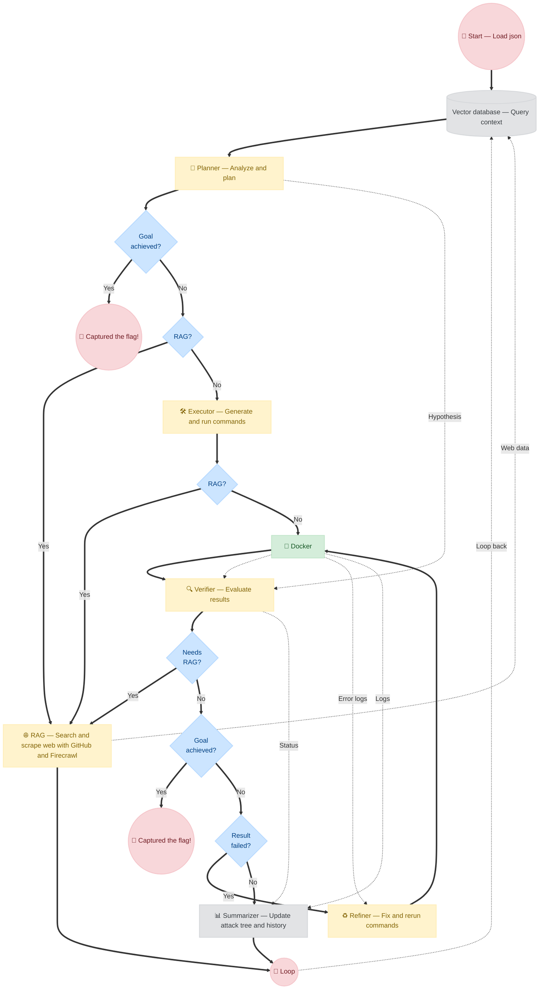

<div align="center">

<pre>
╔══════════════════════════════════════════════════════════════════════════════════╗
║                                                                                  ║
║          ███████╗██╗   ██╗ ██████╗██╗  ██╗     ██████╗████████╗███████╗          ║
║          ██╔════╝██║   ██║██╔════╝██║ ██╔╝    ██╔════╝╚══██╔══╝██╔════╝          ║
║          █████╗  ██║   ██║██║     █████╔╝     ██║        ██║   █████╗            ║
║          ██╔══╝  ██║   ██║██║     ██╔═██╗     ██║        ██║   ██╔══╝            ║
║          ██║     ╚██████╔╝╚██████╗██║  ██╗    ╚██████╗   ██║   ██║               ║
║          ╚═╝      ╚═════╝  ╚═════╝╚═╝  ╚═╝     ╚═════╝   ╚═╝   ╚═╝               ║
║                                                                                  ║
╚══════════════════════════════════════════════════════════════════════════════════╝
</pre>

### Fuck CTF
**An autonomous LLM agent that solves CTF challenges end to end**

[](https://www.python.org/)
[](https://www.docker.com/)
[](https://github.com/Hugnd-UIT)
[](https://www.firecrawl.dev/)
[](LICENSE)
[](#)

</div>

<br>

## 📌 Introduction

**Fuck CTF** is an autonomous LLM-based agent that solves Capture The Flag challenges from start to finish — reading the challenge description, working the problem, and submitting the flag — without human intervention.

The framework orchestrates six specialized AI modules in a closed loop:

> **Planner → Executor → Verifier → Refiner → Summarizer → Reflector**

It dynamically switches between reasoning, web searching, sandboxed code execution, output verification, iterative self-correction, and high-level strategy reflection until the flag is captured.

<br>

## 🧩 Core Capabilities

| Module | Role |
|:---|:---|
| 🐳 Docker | Provides a disposable, isolated environment to safely interact with targets |
| 🧠 Planner | Analyzes the challenge and decomposes it into a prioritized Attack tree of subtasks |
| 🛠️ Executor | Generates and runs terminal commands, compiled binaries, and Python scripts |
| 🔍 Verifier | Evaluates raw command output against the Planner's hypothesis to classify success or failure |
| ♻️ Refiner | Diagnoses errors and rewrites broken commands or scripts to fix failures iteratively |
| 📊 Summarizer | Distills execution logs into structured observations and updates the Attack tree |
| 🪞 Reflector | Intervenes when the agent is stuck for multiple cycles to backtrack and rethink strategy |
| 🌐 RAG | Searches GitHub repos and web pages via Firecrawl when the agent hits an unfamiliar vulnerability |

<br>

## 🏴 Supported Categories
 
| Category | Description |
|:---|:---|
| 🔐 Crypto | Breaking or exploiting classical and modern cryptographic schemes |
| ⚙️ Reverse | Disassembling and analyzing binaries to recover logic or hidden data |
| 💥 Pwn | Exploiting memory corruption and binary vulnerabilities to gain control |
| 🕵️ Forensics | Digging through files, memory dumps, and network captures for hidden clues |
 
<br>

## 🎬 Fuck CTF demo

Here is a real example of how fuck ctf autonomously solves a crypto challenge. It analyzes the parameters, writes a custom exploit script, iteratively fixes syntax errors in its own code, and successfully captures the flag.

<details>
<summary><b>Click to see demo</b></summary>

```text
╔════════════════════════════════════════════════════════════════════════════╗
║                                                                            ║
║      ███████╗██╗   ██╗ ██████╗██╗  ██╗     ██████╗████████╗███████╗        ║
║      ██╔════╝██║   ██║██╔════╝██║ ██╔╝    ██╔════╝╚══██╔══╝██╔════╝        ║
║      █████╗  ██║   ██║██║     █████╔╝     ██║        ██║   █████╗          ║
║      ██╔══╝  ██║   ██║██║     ██╔═██╗     ██║        ██║   ██╔══╝          ║
║      ██║     ╚██████╔╝╚██████╗██║  ██╗    ╚██████╗   ██║   ██║             ║
║      ╚═╝      ╚═════╝  ╚═════╝╚═╝  ╚═╝     ╚═════╝   ╚═╝   ╚═╝             ║
║                                                                            ║
║  Category      : Crypto                                                    ║
║  Description   : If you want my flag, you better vote for Pedro! Can you   ║
║                  sign your vote to the server as Alice?                    ║
║  Host          : socket.cryptohack.org                                     ║
║  Port          : 13375                                                     ║
║  Directory     : /data                                                     ║
║  Time          : 60 minutes                                                ║
╚════════════════════════════════════════════════════════════════════════════╝
● Planning...                                                            28.9s
│  ├─ Thinking...
│  ├─ In cryptography challenges, reading the provided source in 
│  │  full and identifying the exact signature scheme, key type, and
│  │  parameters is the required first step before hypothesizing an
│  │  attack. The time budget is ample, and no static analysis has 
│  │  been done yet.
│  │
│  └─ Read the full Python source and inspect the Alice key file to 
│     identify the digital signature scheme, key format/type, all 
│     relevant parameters, and exactly how votes are signed and 
│     verified.
│
● Executing...                                                           95.9s
│  ├─ The subtask requires reading the challenge source and Alice 
│  │  key material from /data to identify the digital signature 
│  │  scheme, key format, parameters, and signing/verification 
│  │  logic. HISTORY is empty, so the first step is inventorying 
│  │  files, then printing source/key contents and parsing any 
│  │  cryptographic key files.
│  ├─ $ ls -laR /data; openssl version 2>&1 || echo
│  │    OPENSSL_MISSING; find /data -maxdepth 3 -type f -print0 |
│  │    xargs -0 file; echo INVENTORY_COMPLETE
│  ├─ $ find /data -maxdepth 3 -type f -print0 | sort -z | while
│  │    IFS= read -r -d '' f; do echo "===== $f ====="; file "$f";
│  │    case "$f" in *.py|*.txt|*.json) sed -n '1,600p' "$f";;
│  │    *.pem|*.key|*.pub|*.der|*.crt|*.priv) openssl pkey -inform PEM
│  │    -in "$f" -text -noout 2>&1 || openssl pkey -inform DER -in
│  │    "$f" -text -noout 2>&1 || openssl asn1parse -in "$f" 2>&1 ||
│  │    xxd "$f";; *) if grep -Iq . "$f"; then sed -n '1,600p' "$f";
│  │    fi;; esac; echo; done; echo INSPECT_COMPLETE
│  └─ $ grep -RInE 'RSA|DSA|ECDSA|Ed25519|P-256|P-384|P-
│       521|curve|sign|verify|modulus|N ?=|e ?=|d ?=|p ?=|q ?=|g ?=|pr
│       ivate_key|public_key|bytes_to_long|long_to_bytes|encode|vote'
│       /data | head -200; echo GREP_COMPLETE
│
● Verifying...                                                        [ Pass ]
│  └─ Digital signature scheme: RSA with public exponent e = 3 and 
│     modulus N = 22266616657574989868109324252160663470925207690694
│     09495331289128234142688050692464852518101428721435013655794120
│     14454755408302250595146521253104453521750474089660284973168061
│     42156338927162621004774769949534239479839334209147097793526879
│     76241752644573955277203987656815646922449168203031499488024798
│     33329641217593076582700839470054665780771531852061997595699028
│     10832114058818478518470715726064960617482910172035743003538122
│     40244014286149489972572050518166373893115167788421845782467614
│     01908413932178576836278864971049153903852833649711333166723328
│     46071665082777884028170668140862010444247560019193505999704028
│     222347577
│
● Summarizing...                                                        152.3s
│  Updating...
│  └─ ✓ No contradictions detected
│
● Planning...                                                           125.8s
│  ├─ Thinking...
│  ├─ The verification logic is a textbook low-exponent RSA forgery:
│  │  choose x so that x^3 has the target vote as its final bytes. 
│  │  Because the target vote is short, any such x satisfies x^3 < 
│  │  ALICE_N, so pow(x, 3, ALICE_N) preserves those bytes exactly. 
│  │  This should yield a valid vote without needing Alice's private
│  │  key.
│  │
│  └─ Compute a forged vote integer x such that x^3 has the target 
│     vote string as its low-order bytes, verify locally that 
│     long_to_bytes(pow(x,3,ALICE_N)).split on null bytes ends with 
│     the target vote, then submit x as a hex vote to the remote 
│     service and capture the flag.
│
● Executing...                                                          217.1s
│  ├─ The target is a CryptoHack RSA e=3 raw-verification vote 
│  │  oracle. HISTORY confirms verification accepts bytes ending in 
│  │  'VOTE FOR PEDRO' after a null byte. The needed computation is 
│  │  a modular cube root of b'\x00VOTE FOR PEDRO' modulo 
│  │  2^(8*len(payload)), followed by local verification against 
│  │  ALICE_N and a single JSON vote submission to the remote 
│  │  service. The exact ALICE_N value was not captured in HISTORY, 
│  │  so the script will parse it from the provided key file.
│  ├─ $ ls -la /data; grep -RIn --include='*.py'
│  │    --include='*.txt' --include='*.pem' --include='*.pub'
│  │    --include='*.key' -E
│  │    'vote|n[[:space:]]*=|e[[:space:]]*=|RSA|import' /data
│  │    2>/dev/null | head -200
│  └─ $ cat > /tmp/forge_vote.py <<'PY'
│       import os, re, glob, json, socket, sys, time
│       ... (code truncated for brevity) ...
│       PY
│       python3 /tmp/forge_vote.py
│
● Verifying...                                                        [ Fail ]
│  └─ Key file /data/alice_668771701429c4137ea2c6c62249f619.key 
│     cannot be imported by RSA.import_key and lacks a parseable n 
│     value.
│
● Refining...                                                      Retry 1 / 2
│  ├─ The script failed because it could not parse the RSA modulus n
│  │  from any file. The key file contains 'e = 3' but not a 
│  │  lowercase 'n = ...' line; it likely uses 'N = ...' (capital) 
│  │  which the regex does not match. RSA.import_key also fails 
│  │  because the file is not a standard PEM/DER format. The correct
│  │  n is known from the challenge data (ALICE_N) and can be used 
│  │  directly.
│  └─ $ cat > /tmp/forge_vote.py <<'PY'
│       ...
│       n = ALICE_N
│       ...
│       PY
│       python3 /tmp/forge_vote.py
│
● Verifying...                                                        [ Fail ]
│  └─ Python script at /tmp/forge_vote.py has a SyntaxError at line 
│     50: unterminated string literal in 
│     `msg=json.dumps({'option':hexvote})+`
│
● Summarizing...                                                         55.7s
│  Updating...
│  └─ ✓ No contradictions detected
│
● Reflecting...                                                          75.5s
│  └─ Stuck state analyzed and replanned
│
● Planning...                                                            44.6s
│  ├─ Thinking...
│  ├─ The bug class is confirmed: raw RSA verification with e=3 
│  │  accepts any vote whose cube has low bytes equal to b'\x00VOTE 
│  │  FOR PEDRO'. The remaining work is to compute that cube root 
│  │  locally, verify it against the exact long_to_bytes/split/null 
│  │  logic, and save the hex value, without any network dependency.
│  │  This isolates the failed syntax issue and produces a 
│  │  falsifiable local result before sending.
│  │
│  └─ Write and run a small, syntax-checked Python snippet that 
│     computes a modular cube root r of the integer payload 
│     b'\x00VOTE FOR PEDRO' modulo 2^(8*len(payload)), selects the 
│     candidate with r^3 < ALICE_N, verifies locally that 
│     long_to_bytes(r^3).split(b'\x00')[-1] equals b'VOTE FOR 
│     PEDRO', and saves the resulting hex string to /tmp/vote.hex.
│
● Executing...                                                          283.9s
│  ├─ The subtask requires computing a modular cube root of the 
│  │  payload b'\x00VOTE FOR PEDRO' modulo 2^(8*len(payload)), 
│  │  selecting a root whose cube is below ALICE_N, verifying 
│  │  locally, and saving the hex string. HISTORY step_2 failed with
│  │  a SyntaxError from a heredoc/newline-in-string issue, so this
│  │  attempt avoids heredoc and uses printf plus py_compile. 
│  │  ALICE_N is not explicitly captured in HISTORY, so the script 
│  │  locates and parses it from /data.
│  └─ $ set -e; python3 -c 'import sympy, Crypto' 2>/dev/null ||
│       python3 -m pip install sympy pycryptodome; printf '%s
│       ...
│
● Verifying...                                                        [ Fail ]
│  └─ Script compilation succeeded (COMPILE_OK).
│
● Summarizing...                                                         77.7s
│  Updating...
│  └─ ✓ No contradictions detected
│
● Planning...                                                            47.4s
│  ├─ Thinking...
│  ├─ The server verifies by computing pow(vote, 3, N) and checking 
│  │  the final null-separated segment equals the target vote. Since
│  │  e=3 and N is large, a small modular cube root of the target 
│  │  payload below N will forge a valid vote. The only previous 
│  │  blocker was failure to load the already-known modulus.
│  │
│  └─ Hardcode the confirmed ALICE_N and ALICE_E=3 into the forge 
│     script, compute a cube-root candidate for the target vote 
│     payload prefixed with a null separator, verify locally that 
│     its cube is below N and that long_to_bytes(cube) ends with the
│     target vote after the last null, then send the forged vote as
│     hex in a JSON object with keys option='vote' and vote=<hex> 
│     to the target service and capture the returned flag.
│
● Executing...                                                          159.9s
│  ├─ The subtask requires completing the RSA e=3 vote forgery 
│  │  against the remote CryptoHack service. HISTORY confirms the 
│  │  scheme, payload, and previous failures. ALICE_N must be 
│  │  extracted from /data and used because the prompt does not 
│  │  contain its numeric value. The script will extract ALICE_N, 
│  │  compute the cube root modulo 2^(8*payload_len), verify 
│  │  locally, and submit the forged vote.
│  └─ $ python3 - <<'PY'
│       import os, json, socket, sys, base64, subprocess
│       ...
│       PY
│
● Verifying...                                                        [ Pass ]
╭────────────────────────────────────────────────────────────────────────────╮
│                                                                            │
│  Flag: crypto{y0ur_v0t3_i5_my_v0t3}                                        │
│  Time: 25 minutes 38 seconds                                               │
│                                                                            │
╰────────────────────────────────────────────────────────────────────────────╯
```

</details>

<br>

## 📂 Repo Structure

```text
.
├── agent/               Core orchestrator loop and all agent modules
│   ├── planner/         Planner — subtask generation and Attack Tree management
│   ├── executor/        Executor — command generation
│   ├── verifier/        Verifier — result evaluation
│   ├── refiner/         Refiner — error correction
│   ├── summarizer/      Summarizer — observation synthesis
│   ├── reflector/       Reflector — strategy backtracking
│   └── core/            Memory via ChromaDB, state, and shared utilities
├── benchmark/           Challenge JSON configs organized by platform and category
├── cli/                 Terminal UI rendering — ASCII art, panels, progress
├── db/                  Persistent ChromaDB vector store for RAG context
├── docs/                Documentation
├── rag/                 Retrieval-Augmented Generation — GitHub + Firecrawl
├── workspace/           Place challenge files here — mounted to /data in Docker
├── config.example.json  Config template
├── run.py               Main entry point
└── sandbox.py           Docker sandbox lifecycle manager
```

<br>

## ⚙️ Workflow



<br>

## 🚀 Installation

> **Requirements:** Python 3.9+, Docker running

**1. Clone the repository**

```bash
git clone https://github.com/Hugnd-UIT/Fuck-CTF.git
cd Fuck-CTF
```

**2. Create and activate a virtual environment**

```bash
python -m venv venv

# Linux / macOS
source venv/bin/activate

# Windows
.\venv\Scripts\activate
```

**3. Install dependencies**

```bash
pip install -r requirements.txt
```

<br>

## 🔑 Setup

Copy the environment file and fill in your API keys:

```bash
cp .env_example .env
```

| Variable | Description | Required |
|:---|:---|:---:|
| `OPENAI_API_KEY` | OpenAI key, or an OpenRouter / DeepSeek proxy key | ✅ |
| `OPENAI_BASE_URL` | API base URL, needed for proxy providers | ✅ |
| `GITHUB_API_KEY` | GitHub Personal Access Token for RAG search | ✅ |
| `FIRECRAWL_API_KEY` | Firecrawl API key for web scraping | ✅ |
| `HF_TOKEN` | Hugging Face token, local models only | Optional |
| `CUDA_VISIBLE_DEVICES` | GPU IDs for local model inference, e.g. `0,1` | Optional |

<br>

## 🎯 Run a challenge

**1. Drop challenge files into `workspace/`**

If the challenge provides downloadable files — source code, pcap, zip, binary — place them in the `workspace/` directory. This folder is automatically mounted to `/data` inside the Docker container.

> [!WARNING]
> Always **clear `workspace/`** before starting a new challenge. Leftover files from previous runs will confuse the agent.

**2. Create a `config.json`**

Use any file in `benchmark/` as a template, or create one from scratch:

```json
{
    "planner": {
        "model": "openai/gpt-4o",
        "local": false,
        "temperature": 0.7,
        "top": 0.9,
        "sample": true,
        "tokens": 4096
    },
    "executor": {
        "model": "openai/gpt-4o-mini",
        "local": false,
        "temperature": 0.2,
        "top": 1.0,
        "sample": false,
        "tokens": 4096
    },
    "verifier": {
        "model": "openai/gpt-4o-mini",
        "local": false,
        "temperature": 0.1,
        "top": 1.0,
        "sample": false,
        "tokens": 4096
    },
    "refiner": {
        "model": "openai/gpt-4o-mini",
        "local": false,
        "temperature": 0.2,
        "top": 1.0,
        "sample": false,
        "tokens": 4096
    },
    "summarizer": {
        "model": "openai/gpt-4o",
        "local": false,
        "temperature": 0.3,
        "top": 1.0,
        "sample": false,
        "tokens": 4096
    },
    "reflector": {
        "model": "openai/gpt-4o",
        "local": false,
        "temperature": 0.7,
        "top": 1.0,
        "sample": false,
        "tokens": 4096
    },
    "sandbox": "ctf",
    "timeout": 15,
    "limit": 2000,
    "cmd_time": 30,
    "max_time": 600,
    "flag": "flag{FORMAT}",
    "target": {
        "category": "challenge-category",
        "desc": "Description of the challenge...",
        "dir": "/data",
        "host": "target-host-or-ip",
        "port": 1337
    }
}
```

**Config field reference:**

| Field | Type | Description |
|:---|:---|:---|
| `sandbox` | string | Docker image tag for the ephemeral sandbox |
| `timeout` | int, minutes | Total time limit for the entire agent run |
| `cmd_time` | int, seconds | Max execution time for a single command in sandbox |
| `max_time` | int, seconds | Max cumulative sandbox runtime before forced reflection |
| `limit` | int, chars | Max length for truncating long command outputs |
| `flag` | string | Expected flag format to help Verifier detect success |
| `target.dir` | string | Path inside Docker where `workspace/` is mounted — default `/data` |
| `target.host` | string | Challenge host or URL |
| `target.port` | int | Challenge port — leave `""` for web-only challenges |

**3. Run**

```bash
python run.py -c config.json -k
```

The `-k` flag keeps the Docker container alive between runs, significantly speeding up subsequent attempts on the same challenge.

<br>

## 👤 Author

Made by **Hugnd-UIT**

[](https://github.com/Hugnd-UIT)

<br>

## 📜 License

This project is licensed under the **GNU Affero General Public License v3.0**. See [LICENSE](LICENSE) for the full text.

<br>

<div align="center">

© 2026 Hugnd-UIT — All rights reserved under AGPLv3

</div>
