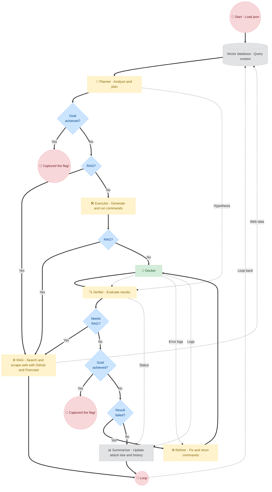

```text
      ███████╗██╗   ██╗ ██████╗██╗  ██╗     ██████╗████████╗███████╗      
      ██╔════╝██║   ██║██╔════╝██║ ██╔╝    ██╔════╝╚══██╔══╝██╔════╝      
      █████╗  ██║   ██║██║     █████╔╝     ██║        ██║   █████╗        
      ██╔══╝  ██║   ██║██║     ██╔═██╗     ██║        ██║   ██╔══╝        
      ██║     ╚██████╔╝╚██████╗██║  ██╗    ╚██████╗   ██║   ██║           
      ╚═╝      ╚═════╝  ╚═════╝╚═╝  ╚═╝     ╚═════╝   ╚═╝   ╚═╝           
```

**Fuck CTF: LLM Agent for Autonomous CTF Solving**

---

### 📌 Introduction

We introduce Fuck CTF, a novel Large Language Model (LLM)-based agent capable of autonomously solving Capture The Flag (CTF) challenges. 

Fuck CTF's multi-module architecture includes a Planner, Executor, Verifier, Refiner, Summarizer, and Reflector. The framework dynamically switches between thinking, searching, executing inside a secure sandbox, verifying, refining its approaches, summarizing its findings, and reflecting on its failures until the flag is captured.

**Core Capabilities:**
- **Dynamic Reasoning & Planning:** The `Planner` automatically breaks down complex black-box challenges into executable subtasks while maintaining a global Attack Tree to track its progress and findings.
- **Retrieval-Augmented Generation:** When facing unfamiliar vulnerabilities, the agent dynamically scrapes GitHub repositories and web pages (via Firecrawl) to acquire exploits, CVE details, and cryptographic scripts.
- **Isolated Sandboxed Execution:** The `Executor` safely runs arbitrary terminal commands, compiled binaries, and Python scripts inside a disposable Docker environment to interact with the target.
- **Autonomous Verification:** The `Verifier` evaluates raw terminal outputs against the Planner's initial hypothesis to objectively determine if a subtask succeeded or failed.
- **Self-Refinement & Reflection:** The `Refiner` diagnoses runtime errors to fix broken exploits iteratively, while the `Reflector` intervenes when the agent is stuck to rethink the overall strategy and backtrack.

---

### 📂 Repo structure

```text
.
├── agent/         # Core orchestrator, planner, executor, verifier, summarizer
├── benchmark/     # Benchmark configurations and challenge JSON files
├── cli/           # CLI tool and ASCII UI rendering
├── db/            # RAG ChromaDB state and context memory
├── docs/          # Framework documentation
├── rag/           # Retrieval-Augmented Generation (GitHub & Firecrawl)
├── workspace/     # Current challenge files mount directory
├── config.example.json 
├── run.py         # Main entry point to launch the agent
└── sandbox.py     # Docker sandbox manager
```

---

### ⚙️ Workflow



---

### 🚀 Installation

The project dependencies are strictly managed through `requirements.txt`. You must have Python 3.9+ and Docker installed. Docker **must be running** locally for the sandbox to operate.

1. **Clone the repository:**
```bash
git clone https://github.com/your-org/FuckCTF.git
cd FuckCTF
```

2. **Setup a virtual environment:**
```bash
python -m venv venv
# On Linux/macOS:
source venv/bin/activate
# On Windows:
.\venv\Scripts\activate
```

3. **Install dependencies:**
```bash
pip install -r requirements.txt
```

---

### 🛠️ Setup

Before running the agent, you must configure the required API keys.

1. Copy the example environment file:
```bash
cp .env_example .env
```

2. Open `.env` and insert your API keys:
- **`OPENAI_API_KEY` / `OPENAI_BASE_URL`**: Get your API key from [OpenAI Platform](https://platform.openai.com/api-keys) (or proxies like OpenRouter/DeepSeek).
- **`HF_TOKEN`** *(Optional for local models)*: Get your access token from [Hugging Face Settings](https://huggingface.co/settings/tokens).
- **`CUDA_VISIBLE_DEVICES`**: Specify the comma-separated IDs of the GPUs to use (e.g. `0`, `0,1`).
- **`GITHUB_API_KEY`**: Generate a personal access token at [GitHub Developer Settings](https://github.com/settings/tokens).
- **`FIRECRAWL_API_KEY`**: Sign up and get your API key at [Firecrawl](https://www.firecrawl.dev/).

---

### 🎯 Fuck CTF

1. **Prepare the workspace:**
   Create a `workspace/` directory in the root of the repository. Whenever you have a new challenge with downloadable files (source code, pcap, zip, binaries), place them inside this `workspace/` folder.

   > [!WARNING]
   > When moving to a new challenge, **clear the `workspace/` directory of old files** so the agent doesn't hallucinate or get confused by leftover scripts from previous runs!

2. **Configure the target:**
   Create a `config.json` file (you can use one of the templates in the `benchmark/` folder). Describe the challenge inside the `target` section:

```json
{
    "planner": {
        "model": "openai/gpt-4o",
        "local": false,
        "temperature": 0.7,
        "top": 0.9,
        "sample": true,
        "tokens": 4096
    },
    "executor": {
        "model": "openai/gpt-4o-mini",
        "local": false,
        "temperature": 0.2,
        "top": 1.0,
        "sample": false,
        "tokens": 4096
    },
    "verifier": {
        "model": "openai/gpt-4o-mini",
        "local": false,
        "temperature": 0.1,
        "top": 1.0,
        "sample": false,
        "tokens": 4096
    },
    "refiner": {
        "model": "openai/gpt-4o-mini",
        "local": false,
        "temperature": 0.2,
        "top": 1.0,
        "sample": false,
        "tokens": 4096
    },
    "summarizer": {
        "model": "openai/gpt-4o",
        "local": false,
        "temperature": 0.3,
        "top": 1.0,
        "sample": false,
        "tokens": 4096
    },
    "reflector": {
        "model": "openai/gpt-4o",
        "local": false,
        "temperature": 0.7,
        "top": 1.0,
        "sample": false,
        "tokens": 4096
    },
    "sandbox": "ctf", // Docker image tag used for the ephemeral sandbox
    "timeout": 15, // Overall time limit for the entire agent run
    "limit": 2000, // Maximum character/token limit for truncating long command outputs
    "cmd_time": 30, // Maximum execution time for a single terminal command
    "max_time": 600, // Maximum cumulative time
    "flag": "crypto{FLAG}", // The expected flag format
    "target": {
        "category": "challenge-category",
        "desc": "Description of the challenge...",
        "dir": "/data",
        "host": "target-host-or-ip",
        "port": "port"
    }
}
```
*Note: The `workspace/` folder on your local machine is automatically mounted to `/data` inside the Docker container.*

3. **Launch the Agent:**
```bash
python run.py -c config.json -k
```
*(The `-k` flag tells the framework to keep the Docker container running after the challenge ends, which speeds up subsequent executions).*